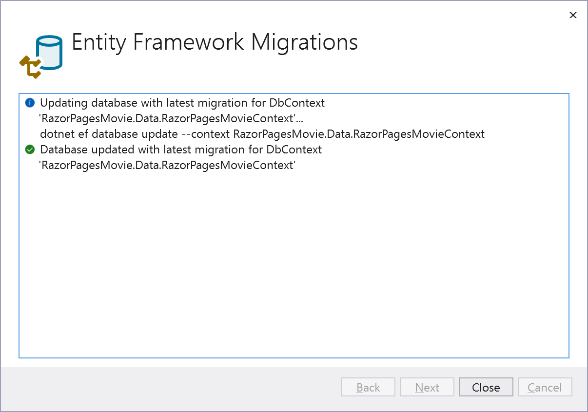
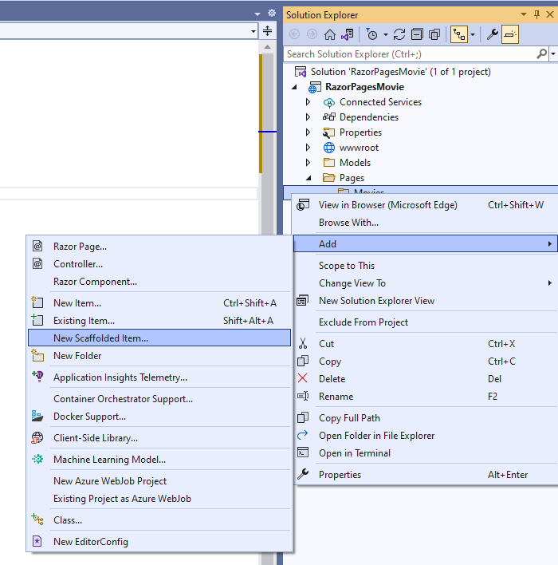

# Create a favorite movies web app based on Razor Pages Movies.

The following tutorial is based on [*"Get started with Razor Pages in ASP.NET Core"*](https://docs.microsoft.com/aspnet/core/tutorials/razor-pages/razor-pages-start) from learn.microsoft.com.

## Prerequisites

- Visual Studio 2022 17.5 or later with the ASP.NET and web development workload
- The Razor Pages Movie source code from the previous lab. If you don't have this available, you can use the *Start* project in this lab's folder.
- The `aspnet-codegenerator` and `dotnet-ef` global tools are required for using VS Code and are recommended even if you're using Visual Studio.

### Install or update global tools

1. Install the `aspnet-codegenerator` global tool by running the following command:

    ```console
   dotnet tool install --global dotnet-aspnet-codegenerator
   ```

    > Tip:
    > If `dotnet-aspnet-codegenerator` is already installed, you can update it with `dotnet tool update --global dotnet-aspnet-codegenerator`.

1. Repeat the above for the `dotnet-ef` global tool.

## What we'll be doing in this lab

This is a follow-on lab that builds on the Razor Pages Movies tutorial. Here's the idea: after building out a simple movie list website with Razor Pages, we got inspired! Why not add some more features to list the best movies, a public front-end Blazor site to show them off, and an API to connect the two sites? Sounds like a great opportunity to keep learning ASP.NET Core, too... Let's get started! 

In order to expand from a simple project to a solution, we'll be changing our project our structure and EF Core model to support multiple projects and add Genres to our movies.

## Adding a shared class library

Part of our initial work will involve changing our data model a bit. We'll be adding in an API and Blazor project later, so let's set up a shared class library for our EF Model classes before we expand out our data model. This will be save us some work compared to changing things after we've built out the front end.

Add a new Class Library project named *AmazingMovies.Models*. 

### Adding a new Class Library using Visual Studio

1. In the **File** menu, select **File** > **Add** > ***New Project**. 
1. Choose the **Class Library** template and click **Next**.
1. Select **.NET 7** and click **Create**.

### Adding a new Class Library using the command line

1. In the root of the solution (containing `RazorPagesMovie.sln`) type `dotnet new classlib -o AmazingMovies.Models -f net7.0`
1. In the same directory, type `dotnet sln add AmazingMovies.Shared`.

## Rename the solution

While we're at it, let's quickly rename our solution to *AmazingMovies*.

In Visual Studio, right-click the solution and select **Rename**. Change the solution name to `AmazingMovies` and hit enter.

If using the command line or another file, rename `RazorPagesMovie.sln` to `AmazingMovies.sln`. For example: `ren RazorPagesMovie.sln AmazingMovies.sln`

## Add the Model classes

One of our improvements to the project will be to make `Genre` a first-class concept rather than just a string in the `Movie` model. This will allow us to validate that new movies are added with a valid genre, simplify browsing by Genre, and probably some other fabulous features we haven't even thought of yet.

We'll add our model classes to the new `AmazingMovies.Models` project next.

1. Delete the `Class1.cs` file from the project if it exists.
1. Add a new `Movie.cs` class to the `AmazingMovies.Models` project.
1. Add a new `Genre.cs` class to the `AmazingMovies.Models` project.

Replace the code in `Genre.cs` with the following:

```csharp
namespace AmazingMovies.Models
{
    public class Genre
    {
        public int ID { get; set; }
        public string Name { get; set; } = string.Empty;
    }
}
```

Replace the code in `Movie.cs` with the following (this is exact same code from the previous project, only the namespace has been updated):

```csharp
public class Movie
{
    public int ID { get; set; }
    public string? Title { get; set; }

    [Display(Name = "Release Date")]
    [DataType(DataType.Date)]
    public DateTime ReleaseDate { get; set; }
    public string? Genre { get; set; }

    [Column(TypeName = "decimal(18, 2)")]
    public decimal Price { get; set; }
}
```

Next, we want to update our `Movie` model to reference the `Genre` class instead of using a string.

In the `Movie` class, replace this line:

```csharp
public string? Genre { get; set; }
```

```csharp
public Genre? Genre { get; set; } = null;
public int GenreId { get; set; }
```

Once we update our `DbContext`, this will tell EF Core to establish a one-to-many relationship between *Genre* and *Movie* so that one *Genre* can have many *Movies*, while each *Movie* can have one *Genre*.

> Note: There are several options for defining relationships in EF Core. We don't have to include `GenreId` to establish a relationship, but it will simplify integration with Razor Pages later.

Build the solution to make sure everything is working before we change over the Razor Pages application to use this new shared library.

### Add a reference to the AmazingMovies.Models project

If using Visual Studio, right-click on the **RazorPagesMovie** project and select **Add** > **Project Reference**, then check the **AmazingMovies.Models** project.

If using the command line or another IDE, change directory to the **RazorPagesMovie** project (containing `RazorPagesMovie.csproj`). Type the following:

```bash
`dotnet add reference ../AmazingMovies.Models`
```

## Delete scaffolded Movie pages

The next few steps will break our existing scaffolded Razor Pages. This is a value decision to weigh tradeoffs - is it more difficult to fix the existing pages or just re-scaffold them? In this case, it will be easier to delete them and re-implement the search logic on the *Index* page. One of the benefits of scaffolding, especially early in the development cycle, is that you can just delete and re-scaffold pages.

Delete the *Movies* subdirectory from the *Pages* directory in the *RazorPagesMovie* project.

### Update DbContext

1. In the **RazorPagesMovie** project, open `Data/RazorPagesMovieContext.cs`.
1. Change the using statement from `RazorPagesMovie.Models` to `AmazingMovies.Models`.
1. Below the `DbSet<Movie>` line, add the following:

   ```csharp
   public DbSet<Genre> Genre { get; set; } = default!;
   ```

1. Build the project to make sure it compiles.

## Create and run migration

Next we need to create and run a database migration to keep our database in sync with our models and *DbContext*.

### Using Visual Studio

1. Double-click the *Connected Services* node in *Solution Explorer* just below the *RazorPagesMovie* project.
1. Click on the "..." button to the right of the *SQLite* connection in the *Service Dependencies* section and select *Add Migration*.

    

1. After the dialog finds the *DbContext*, name the migration (e.g. "Moved models and added Genre") and create the migration.

    

1. In the *Connected Services* menu, select *Update Database*.

### Command Line

1. Change directory to the *RazorPagesMovie* directory.
1. Create the migration using `dotnet ef migrations add "Moved models and added Genre"`
1. Update the database using `dotnet ef database update`

## Update the Razor Page Movie project to use the new models

### Remove the old model

1. Delete the *Models* directory in the *RazorPagesMovie* project. 
1. Build the project to ensure we can scaffold the new model classes.

## Scaffold the Genre and Movie pages

Since this project will be used as our backend admin system, it makes more sense for our scaffolded pages to be in an `Admin` directory instead of a `Movies` directory. We'll create that directory and scaffold our new classes.

1. Create a new subdirectory below *Pages* in the *RazorPagesMovie* project named *Admin*.
1. Create a *Genres* subdirectory below *Admin*.
1. Create a *Movies* subdirectory below *Admin*.

    

### Scaffold the Movie and Genre classes using Visual Studio

1. In **Solution Explorer**, right click on the `Pages/Admin/Movies` folder. Select **Add** > **New Scaffolded Item**.
  
    

1. In the **Add New Scaffolded Item** dialog, select **Razor Pages** on the left pane and select **Razor Pages using Entity Framework (CRUD)** on the right pane. Then select **Add**.
  
    

1. Complete the **Add Razor Pages using Entity Framework (CRUD)** dialog:
   1. In the **Model class** drop down, select **Movie (AmazingMovies.Models)**.
   1. In the **Data context class** row, select **RazorPagesMovieContext**.

    

1. Repeat the above process for the *Genre* class, being sure you are scaffolding into the `Pages/Admin/Genres` directory.


### Scaffold the Movie class using command line

1. Scaffold the Movie class using the following command:

    ```console
    dotnet aspnet-codegenerator razorpage -m Movie -dc RazorPagesMovieContext -udl -outDir Pages/Admin/Movies --referenceScriptLibraries
    ``` 

1. Scaffold the Genre class using the following command:

    ```console
    dotnet aspnet-codegenerator razorpage -m Genre -dc RazorPagesMovieContext -udl -outDir Pages/Admin/Genres --referenceScriptLibraries
    ```

## Run the updated application

1. Run the project and browse to `/Admin/Genres` and add two Genres: *Action* and *Adventure*.
1. Browse to `/Admin/Movies` and add a new movie with the *Action* genre.

## Restore search functionality on the Index page 

The new scaffolded pages are working, but we need to restore the *Index* page to restore the search and *Genre* filter.

1. Open the *Index.cshtml* page in the *Pages/Admin/Movies* directory.
1. Add the following property:
    
    ```csharp
    public SelectList Genres { get; set; } = default!;
    ```

1. Change the `OnGetAsync` method to read as follows:

    ```csharp
    public async Task OnGetAsync(int? GenreId, string searchString)
    {
        if (_context.Movie != null)
        {
            Movie = await _context.Movie
            .Include(m => m.Genre).ToListAsync();

            var genres = Movie.Select(m => m.Genre).ToList();

            if (!String.IsNullOrEmpty(searchString))
            {
                Movie = Movie
                    .Where(s => s.Title.Contains(searchString))
                    .ToList();
            }

            if(GenreId != null)
            {
                Movie = Movie
                    .Where(m => m.GenreId == GenreId)
                    .ToList();
            }

            Genres = new SelectList(genres, nameof(Genre.ID), nameof(Genre.Name));
        }
    }
    ```

1. Add the following search form directly above the table:

    ```html
    <form>
        <p>
            <select asp-for="GenreId" asp-items="Model.Genres">
                <option value="">All</option>
            </select>

            Movie Title: <input type="text" name="SearchString">
            <input type="submit" value="Filter" />
        </p>
    </form>    
    ```

1. Compare the updated search queries and form to the original *Index.cshtml* page in the *Start* folder to see the changes.

## Summary

Okay! We're done with this lab. We did a lot to set ourselves up for the following units:
- Created a new class library project to hold our models
- Refactored the existing *RazorPagesMovie* project to use the new models
- Created and ran several data migrations - hopefully you're getting pretty used to that!
- Scaffolded Genre and Movie pages based on the new models
- Updated the *Index* page to restore search functionality using the new strongly typed models

In the next unit, we'll look more at Razor syntax and Razor Pages features we can use use to improve our application.